# Logic màn Google Ads theo thao tác người dùng

Ngày đối chiếu code: 15/09/2026.

> **Ảnh minh họa:** 39 ảnh sơ đồ theo code, mỗi ảnh cho một thao tác hoặc bước nhận kết quả; không phải ảnh chụp giao diện thật. Các ảnh nằm trong `assets/google-ads-user-flow/` bên cạnh tài liệu.

## 1. Phạm vi và mục đích

Tài liệu mô tả tab có tên đầy đủ **Google Ads**, tại `/dashboard?tab=keyword-planner`, dựa trên code trong `client/` và `server/` của dự án đang chạy. Tab này gồm **Keyword Planner** và **Ủy quyền Mail**. Mục “Quét quảng cáo” có nhãn rút gọn cũng là “Google Ads”, nhưng là màn riêng, tại `tab=search-ads`, không thuộc phạm vi tài liệu này.

Mục đích của màn: kết nối tài khoản Google Ads, nghiên cứu từ khóa, chọn cơ hội đáng theo dõi, lưu thành dự án tiềm năng rồi chuyển sang danh sách dự án để tiếp tục làm việc.

“Backend” (BE) dưới đây là phần máy chủ xử lý yêu cầu và lưu dữ liệu. “Snapshot” là bản dữ liệu được lưu lại tại một lần nghiên cứu.

Luồng thông thường:

**Thêm Gmail → Gửi link ủy quyền → Chủ Gmail đồng ý trên Google → Hệ thống lưu tài khoản Ads → Khám phá keyword → Lọc và chọn keyword → Lưu dự án tiềm năng → Chuyển thành dự án.**

## 2. Khi người dùng mở tab

Mặc định mở Keyword Planner, mục “Khám phá từ khóa”. Hệ thống tải:

- Các tài khoản Ads đã lưu của người đang đăng nhập; tự chọn tài khoản đầu tiên nếu có.
- Các dự án hiện có để người dùng có thể gắn lần nghiên cứu vào một dự án.
- Lịch sử nghiên cứu và số dự án tiềm năng.

Nếu chưa có tài khoản Ads, màn hướng dẫn sang “Ủy quyền Mail” và không cho bấm khám phá keyword. Nếu có lịch sử, người dùng có thể mở lại lần nghiên cứu đã hoàn tất.

Backend lấy những dữ liệu này từ cơ sở dữ liệu của ứng dụng. Mở tab không tự quét lại dữ liệu từ Google.

<!-- illustration:start -->
**Minh họa: Mở tab Google Ads**

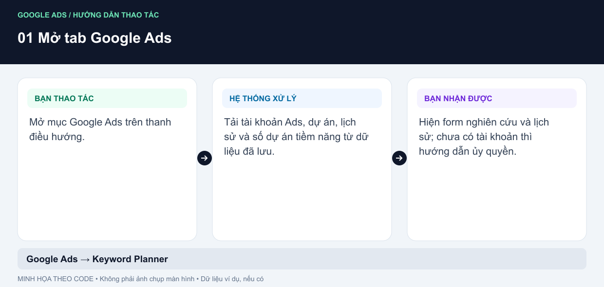

**Minh họa: Mở phần Ủy quyền Mail**

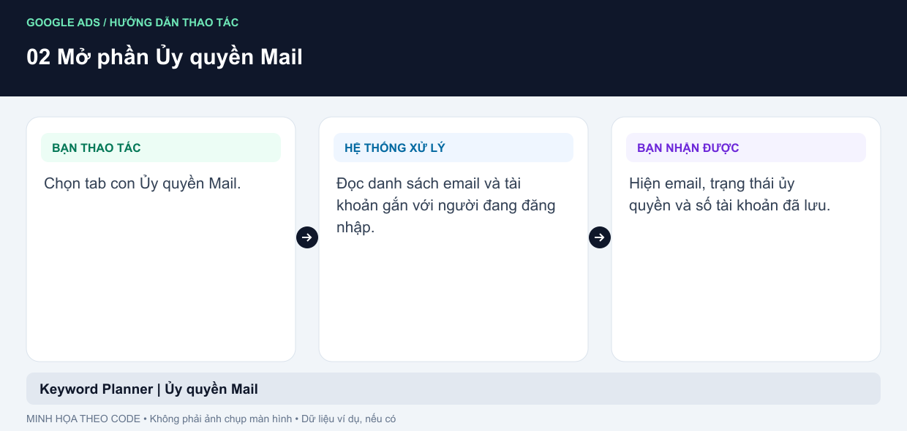
<!-- illustration:end -->

## 3. Kết nối tài khoản ở “Ủy quyền Mail”

### 3.1. Thêm Gmail

**Người dùng:** mở “Thêm Gmail để ủy quyền”, nhập email, bấm “Thêm mail”.

**Hệ thống:** kiểm tra định dạng email và kiểm tra email đã nằm trong danh sách của chính người dùng chưa. Nếu trùng, báo lỗi. Nếu hợp lệ, lưu email vào danh sách với trạng thái “Chưa ủy quyền”.

Thêm email mới chỉ tạo bản ghi; người dùng cần thực hiện bước gửi auth tiếp theo.

<!-- illustration:start -->
**Minh họa: Thêm Gmail**

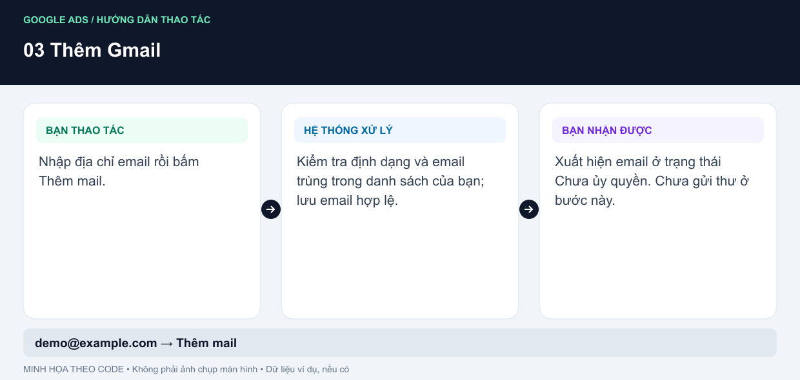
<!-- illustration:end -->

### 3.2. Gửi auth

**Người dùng:** bấm “Gửi auth” trên email chưa ủy quyền.

**Backend:**

1. Kiểm tra email thuộc người đang đăng nhập.
2. Tạo đường dẫn xác nhận của Google kèm thông tin đối chiếu để nhận diện yêu cầu và thời hạn sử dụng theo cấu hình.
3. Lưu thông tin yêu cầu ủy quyền.
4. Gửi email có đường dẫn xác nhận tới địa chỉ vừa chọn qua dịch vụ Gmail đã cấu hình.

**Kết quả:** hiện thông báo đã gửi email. Nếu gửi thất bại, giao diện báo kiểm tra cấu hình Gmail. Bấm gửi lại khi chưa ủy quyền tạo thông tin xác nhận mới; link cũ có thể không còn hợp lệ.

<!-- illustration:start -->
**Minh họa: Gửi link ủy quyền**

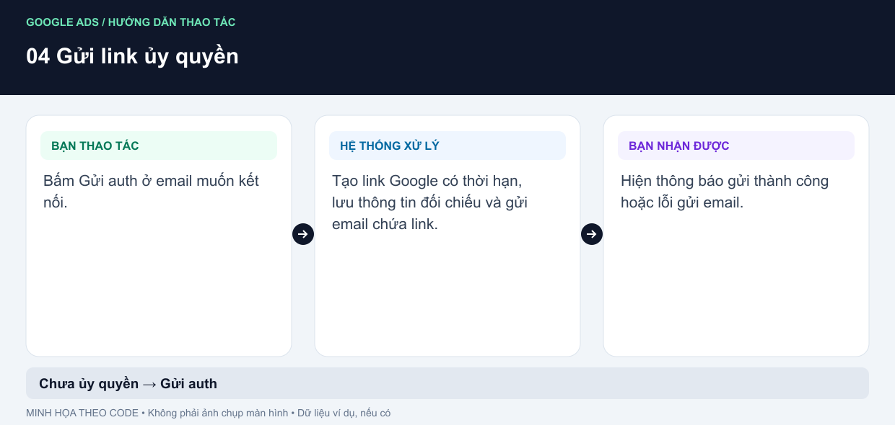
<!-- illustration:end -->

### 3.3. Chủ Gmail xác nhận trên Google

**Người nhận:** mở email, bấm link, đăng nhập đúng Gmail được mời và chấp thuận quyền truy cập.

**Backend sau khi Google trả kết quả:**

1. Kiểm tra yêu cầu ủy quyền tồn tại, còn hạn và có thông tin xác thực cần thiết.
2. Đổi mã xác nhận từ Google thành thông tin truy cập để ứng dụng có thể tiếp tục đọc dữ liệu sau này.
3. Kiểm tra Gmail vừa đăng nhập khớp với email được mời. Nếu khác, từ chối.
4. Lưu thông tin truy cập và đánh dấu email đã ủy quyền.
5. Hỏi Google danh sách tài khoản Ads có thể truy cập; đọc thêm các tài khoản con dưới tài khoản quản lý nếu có.
6. Thu thập tên, ID, trạng thái, tiền tệ, múi giờ và thông tin ngân sách nếu đọc được.
7. Tự lưu các tài khoản chưa có trong danh sách tài khoản của người dùng. Tài khoản đã có được bỏ qua ở bước thêm mới.
8. Lưu thông báo kết quả trong ứng dụng và đẩy thông báo trực tiếp tới người dùng đang online.

**Kết quả:** trang xác nhận hiện thành công cùng cây tài khoản tìm được; tab Ủy quyền Mail nhận sự kiện để tải lại danh sách. Người dùng cũng có thể bấm “Làm mới”. Khi quay lại Keyword Planner, các tài khoản được tải vào ô lựa chọn.

Code hiện tại **tự thêm tài khoản sau khi xác nhận**, dù phần mô tả đầu màn vẫn dùng từ “import”. Người dùng không cần chọn từng tài khoản để import trong luồng giao diện này.

Nếu bước quét tài khoản Google gặp lỗi, backend hiện bắt lỗi và trả danh sách rỗng. Vì vậy có thể xuất hiện tình huống **ủy quyền thành công nhưng chưa có tài khoản Ads để chọn**.

<!-- illustration:start -->
**Minh họa: Mở link và xác nhận Google**

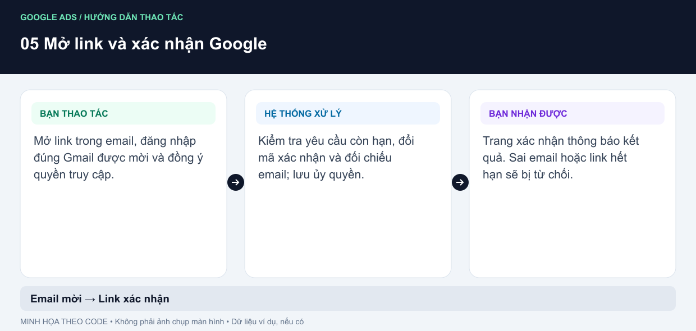

**Minh họa: Nhận danh sách tài khoản Ads**

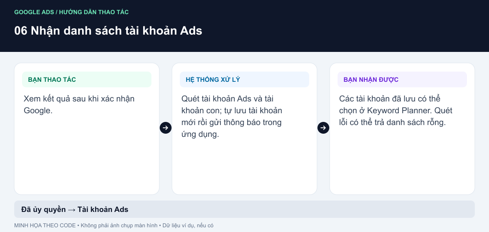
<!-- illustration:end -->

### 3.4. Xem tài khoản, làm mới và xóa mail

| Thao tác | Xử lý bên dưới và kết quả |
|---|---|
| Mở rộng email đã ủy quyền | Hiện các tài khoản đã lưu: tên, ID, trạng thái, tiền tệ, múi giờ; thông tin ngân sách hiện khi có dữ liệu. |
| Làm mới | Tải lại danh sách đã lưu trong ứng dụng; không tự quét lại Google. |
| Xóa mail | Backend kiểm tra quyền sở hữu, xóa email cùng thông tin ủy quyền và tài khoản Ads gắn với email đó trong ứng dụng. Giao diện hiện tại xóa ngay, không có hộp xác nhận. |

Xóa mail không gọi Google để thu hồi quyền đã cấp. Các lần nghiên cứu keyword và dự án tiềm năng được lưu riêng.

<!-- illustration:start -->
**Minh họa: Xem tài khoản của một Gmail**

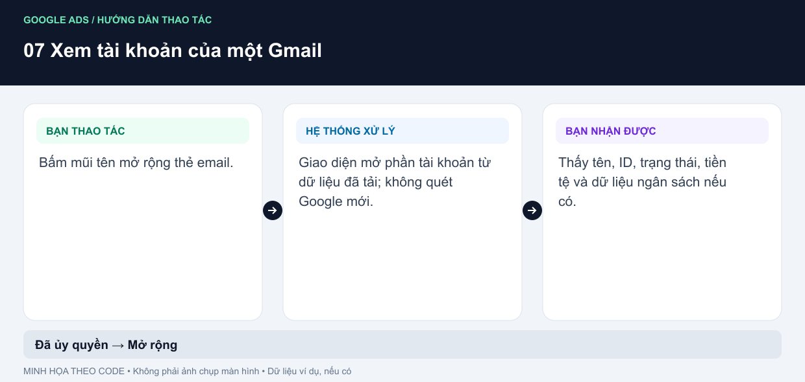

**Minh họa: Làm mới danh sách mail**

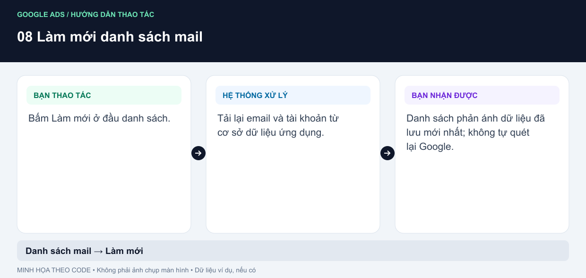

**Minh họa: Gửi auth lại**

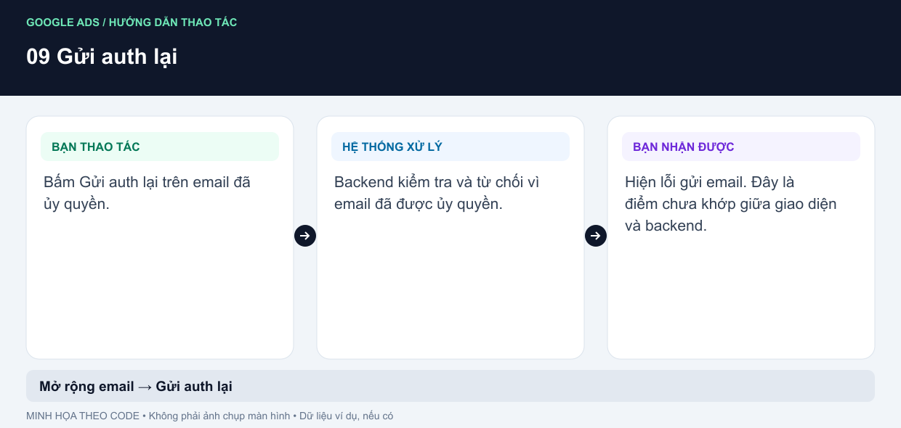

**Minh họa: Xóa mail**

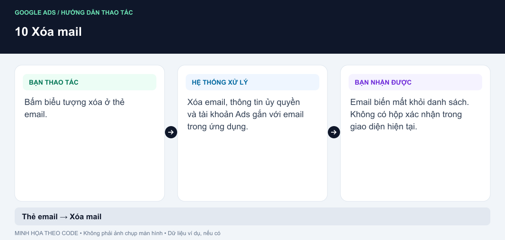
<!-- illustration:end -->

## 4. Khám phá từ khóa

### 4.1. Người dùng thiết lập nghiên cứu

| Trường | Cách sử dụng và ý nghĩa |
|---|---|
| Tài khoản Google Ads | Chọn tài khoản đã được lưu sau ủy quyền để đọc dữ liệu Keyword Planner. |
| Gắn dự án hiện có | Tùy chọn. Chọn dự án sẽ điền URL affiliate của dự án vào form và lưu liên kết của lần nghiên cứu với dự án đó. |
| Chế độ “Từ khóa” | Nhập keyword gốc, mỗi dòng hoặc ngăn cách bằng dấu phẩy. Có thể thêm URL để Google kết hợp cả hai nguồn gợi ý. |
| Chế độ “Website” | Nhập URL. Bật “Phân tích toàn bộ website” để gửi tên miền; tắt để gửi URL trang cụ thể. |
| Ngôn ngữ | Mặc định English; có thêm tiếng Việt, Nhật, Hàn và Trung giản thể. |
| Thị trường | Mặc định tất cả thị trường; có lựa chọn Việt Nam, Hoa Kỳ, Vương quốc Anh, Canada, Úc. Mỗi lần chọn một thị trường trên giao diện. |
| Giới hạn kết quả | Mặc định 500, điều chỉnh từ 50 đến 2.000 theo bước 50. Đây là số tối đa muốn nhận, không đảm bảo Google trả đủ. |

URL thiếu phần giao thức sẽ được giao diện thêm `https://`. Keyword được tách theo dấu phẩy/xuống dòng, bỏ khoảng trắng ở đầu cuối và các phần trống.

<!-- illustration:start -->
**Minh họa: Chọn tài khoản Google Ads**

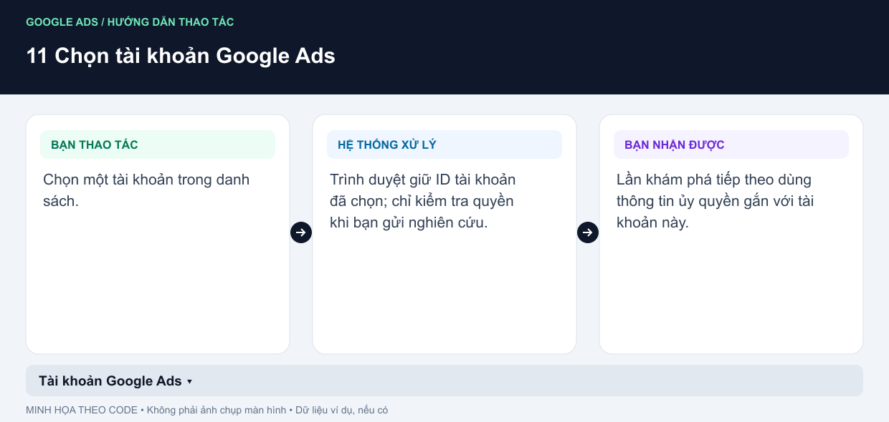

**Minh họa: Gắn dự án hiện có**

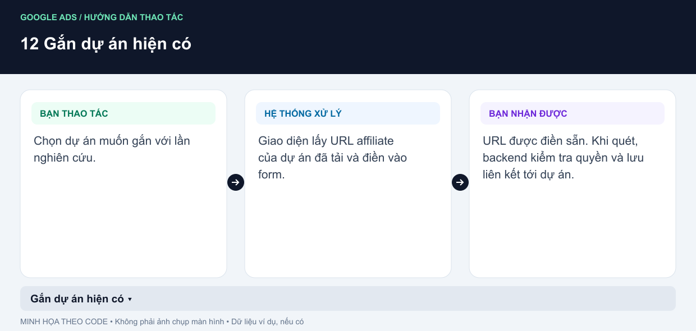

**Minh họa: Nhập keyword gốc**

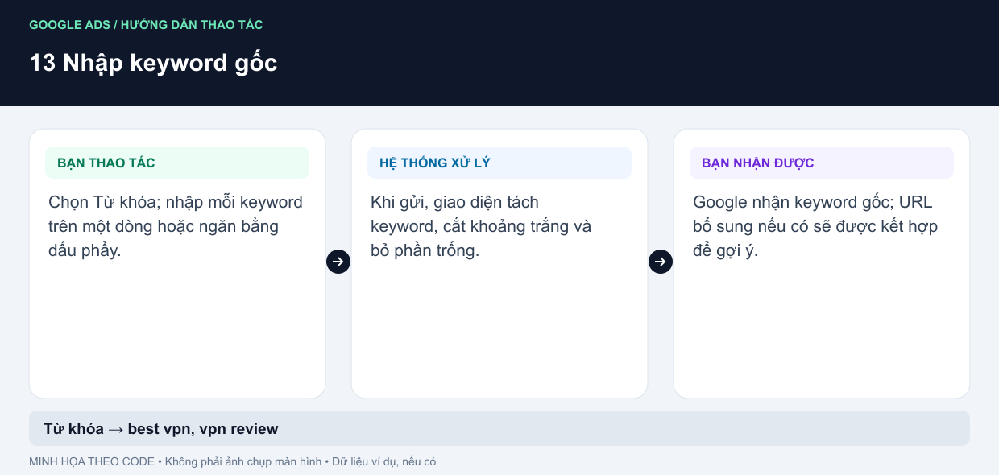

**Minh họa: Nghiên cứu bằng website**

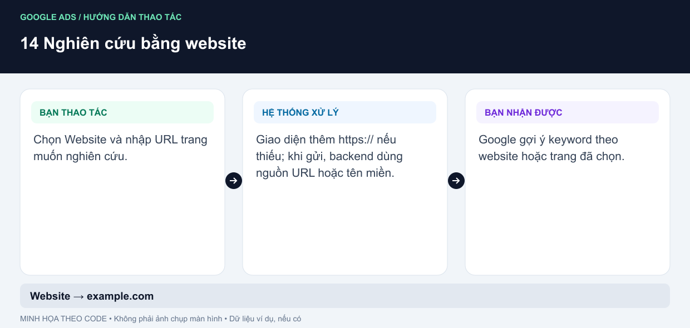

**Minh họa: Chọn phạm vi website**

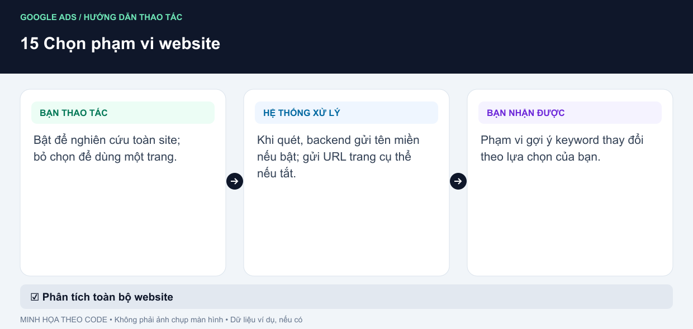

**Minh họa: Chọn ngôn ngữ**

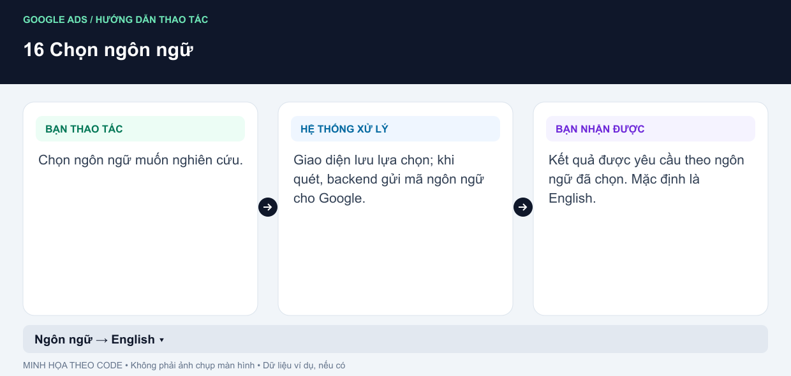

**Minh họa: Chọn thị trường**

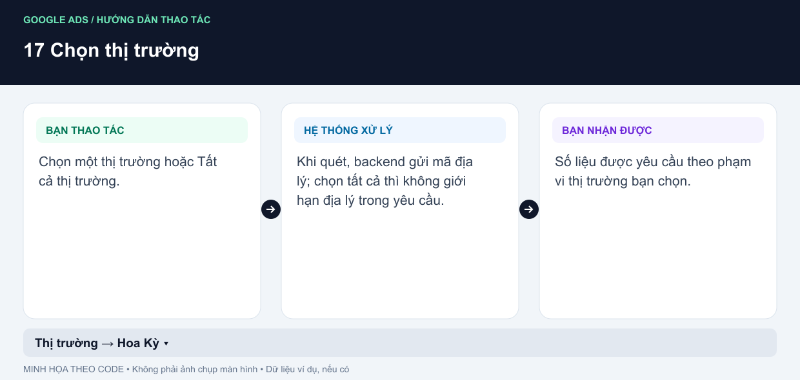

**Minh họa: Đặt giới hạn kết quả**

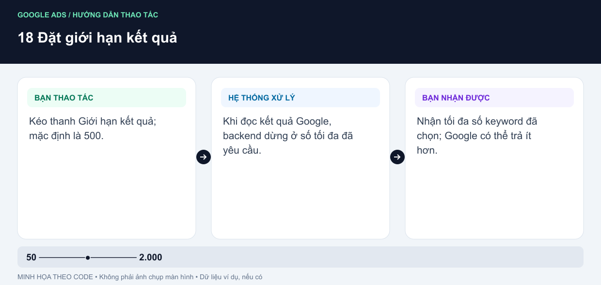
<!-- illustration:end -->

### 4.2. Khi bấm “Khám phá keyword”

**Trên giao diện:** nút chuyển sang “Đang lấy dữ liệu…” và tạm khóa để tránh bấm lặp.

**Backend thực hiện lần lượt:**

1. Kiểm tra người dùng đã đăng nhập.
2. Tìm tài khoản Ads đã chọn trong dữ liệu của người đó và kiểm tra thông tin ủy quyền còn được lưu.
3. Nếu có gắn dự án, kiểm tra dự án thuộc người dùng và lấy tên dự án.
4. Tạo một bản ghi nghiên cứu, gồm tài khoản, nguồn đầu vào, ngôn ngữ, thị trường, giới hạn kết quả và dự án liên quan.
5. Gọi Google Ads Keyword Planner bằng quyền của Gmail đã kết nối. Với tài khoản con, truyền thêm ID tài khoản quản lý đã lưu.
6. Yêu cầu dữ liệu cho mạng Google Search, theo keyword, keyword kết hợp URL, trang cụ thể hoặc tên miền tùy lựa chọn.
7. Đọc các gợi ý Google trả về, dừng ở giới hạn đã chọn.
8. Lưu keyword và số liệu, đánh dấu lần nghiên cứu hoàn tất.
9. Tính thêm mục đích tìm kiếm, xu hướng và điểm cơ hội bằng quy tắc của ứng dụng, rồi trả kết quả lên màn hình.

Đây là yêu cầu chờ xử lý xong mới trả kết quả. Luồng Keyword Planner này không đưa công việc vào ARQ/Redis và không có nút hủy hoặc thanh phần trăm tiến độ.

Nếu Google trả lỗi, backend thông thường lưu lần nghiên cứu ở trạng thái lỗi; giao diện hiện thông báo chung yêu cầu kiểm tra quyền Google Ads. Lỗi tài khoản/dự án trước bước tạo nghiên cứu sẽ không tạo lịch sử mới.

<!-- illustration:start -->
**Minh họa: Bắt đầu khám phá keyword**

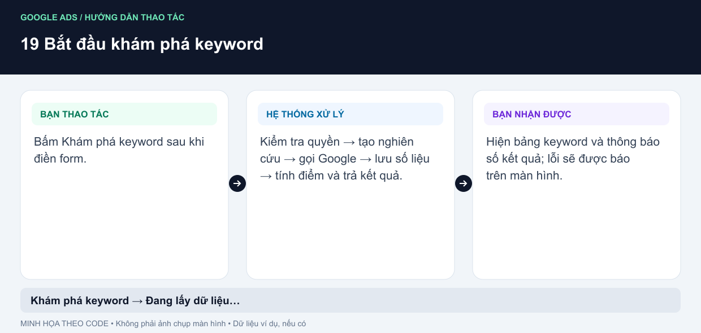
<!-- illustration:end -->

## 5. Đọc kết quả và hiểu cách tính

### 5.1. Các số liệu trên màn hình

- **Keyword ideas:** số từ khóa nhận được.
- **Tổng nhu cầu:** cộng lượng tìm kiếm trung bình/tháng của tất cả keyword trong lần nghiên cứu; đây không phải số người dùng duy nhất.
- **Cạnh tranh TB:** trung bình chỉ số cạnh tranh của các keyword có chỉ số này.
- **Cơ hội mạnh nhất:** điểm cao nhất trong tập kết quả.

Mỗi dòng có keyword, lượng tìm kiếm/tháng, phần trăm xu hướng, mục đích tìm kiếm, mức cạnh tranh, khoảng giá thầu đầu trang và điểm cơ hội. Bấm mũi tên cuối dòng để đọc giải thích điểm.

Google cung cấp keyword và số liệu tìm kiếm/cạnh tranh/giá thầu. Ứng dụng giữ tối đa 12 tháng dữ liệu tìm kiếm gần nhất mà Google trả về. **Mục đích, xu hướng và điểm cơ hội do ứng dụng tự tính.**

<!-- illustration:start -->
**Minh họa: Đọc số liệu kết quả**

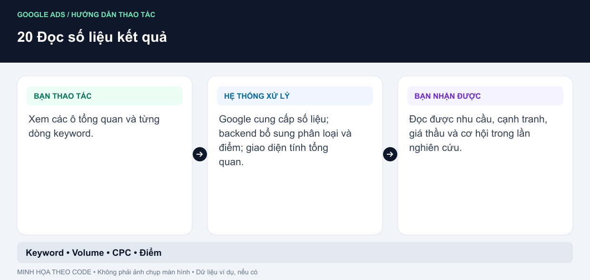
<!-- illustration:end -->

### 5.2. Mục đích tìm kiếm

Code nhận diện bằng từ xuất hiện trong keyword, theo thứ tự ưu tiên:

1. Điều hướng: ví dụ `login`, `official`, `website`, `app`.
2. Giao dịch: ví dụ `buy`, `pricing`, `coupon`, `trial`.
3. Thương mại: ví dụ `best`, `review`, `compare`, `vs`.
4. Thông tin: ví dụ `how`, `guide`, `tutorial`.
5. Không khớp: “Chưa rõ”.

Đây là bộ quy tắc từ tiếng Anh có sẵn, không phải phân tích bằng AI. Keyword tiếng Việt có thể được xếp “Chưa rõ”. Khi một keyword khớp nhiều nhóm, nhóm đứng trước được ưu tiên.

### 5.3. Điểm cơ hội từ 0 đến 100

| Thành phần | Điểm tối đa | Cách hiểu theo code |
|---|---:|---|
| Nhu cầu | 45 | Lượng tìm kiếm cao hơn trong cùng lần nghiên cứu được nhiều điểm hơn; dùng phép tính giảm độ chênh giữa keyword quá lớn và quá nhỏ. |
| Cạnh tranh | 25 | Chỉ số cạnh tranh thấp được nhiều điểm hơn. |
| Giá thầu | 20 | Giá thầu đầu trang mức cao lớn hơn trong tập kết quả được nhiều điểm hơn. |
| Xu hướng | 10 | Tìm kiếm tăng được nhiều điểm hơn. |

Xếp loại: **cao từ 75**, **trung bình từ 45 đến 74**, **thấp dưới 45**.

Xu hướng so sánh tháng đầu và tháng cuối có lượng tìm kiếm lớn hơn 0, trong dữ liệu đã lưu. Kết quả bị giới hạn từ -100% đến +100%; thiếu hai tháng có dữ liệu dương thì trả 0%.

Điểm phụ thuộc tập keyword nhận được ở mỗi lần nghiên cứu. Cùng một keyword có thể có điểm khác khi đầu vào hoặc giới hạn kết quả thay đổi. Điểm giúp ưu tiên nghiên cứu, không phải dự báo lợi nhuận. Giá thầu cao đang được cộng điểm, không được coi là lợi thế chi phí thấp.

<!-- illustration:start -->
**Minh họa: Xem giải thích điểm cơ hội**

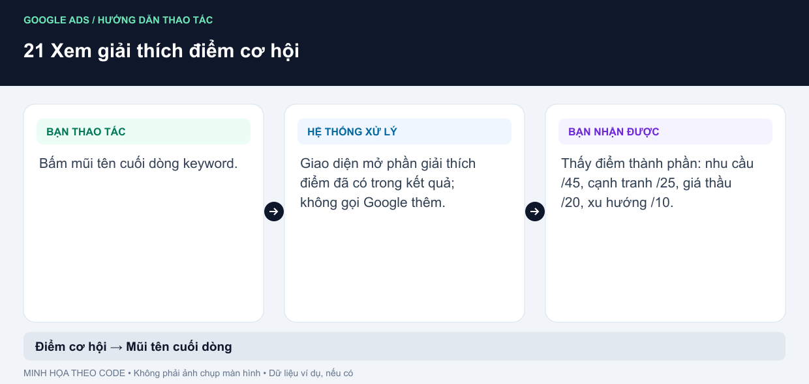
<!-- illustration:end -->

### 5.4. Lọc, sắp xếp và chọn keyword

Người dùng có thể:

- Tìm theo chữ trong keyword.
- Lọc theo nhóm cơ hội, mục đích thương mại/giao dịch/thông tin, lượng tìm kiếm tối thiểu và CPC tối đa.
- Sắp xếp theo điểm, lượng tìm kiếm, cạnh tranh, CPC, xu hướng hoặc tên A–Z.
- Chọn từng keyword; checkbox đầu bảng chọn/bỏ chọn toàn bộ kết quả đang lọc.

Các thao tác trên chạy ngay trong trình duyệt, không gọi Google và không cập nhật cơ sở dữ liệu. Lọc CPC dùng **mức giá thầu đầu trang cao**. Keyword thiếu giá thầu được coi là 0 trong phép lọc này.

Các ô tổng quan vẫn tính trên toàn bộ kết quả, không đổi theo bộ lọc. Keyword đã chọn nhưng sau đó bị bộ lọc ẩn vẫn nằm trong danh sách lựa chọn để lưu.

<!-- illustration:start -->
**Minh họa: Lọc keyword**

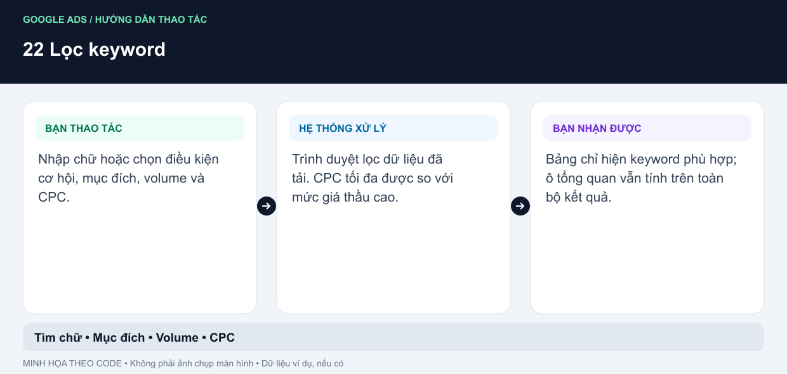

**Minh họa: Sắp xếp keyword**

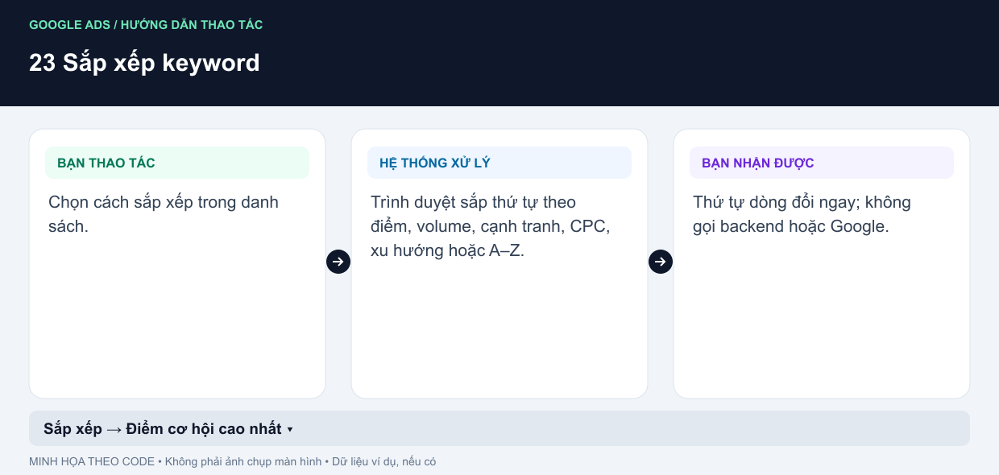

**Minh họa: Chọn từng keyword**

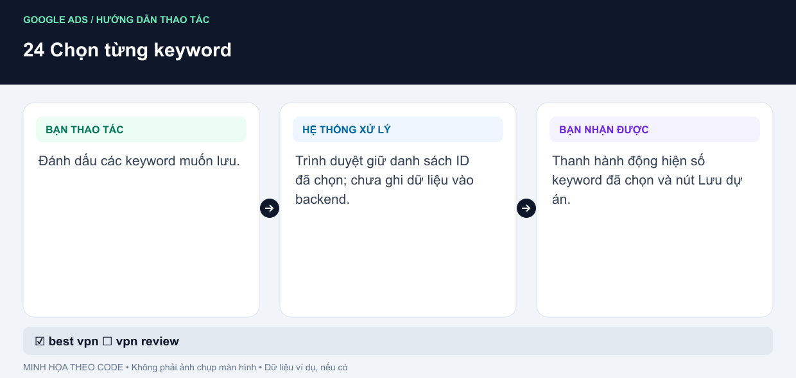

**Minh họa: Chọn tất cả kết quả đang lọc**

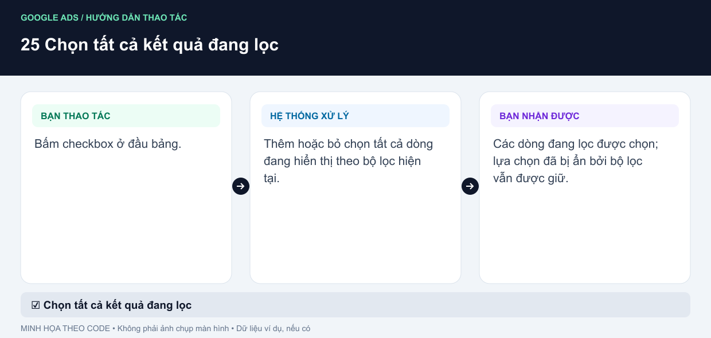

**Minh họa: Xóa bộ lọc**

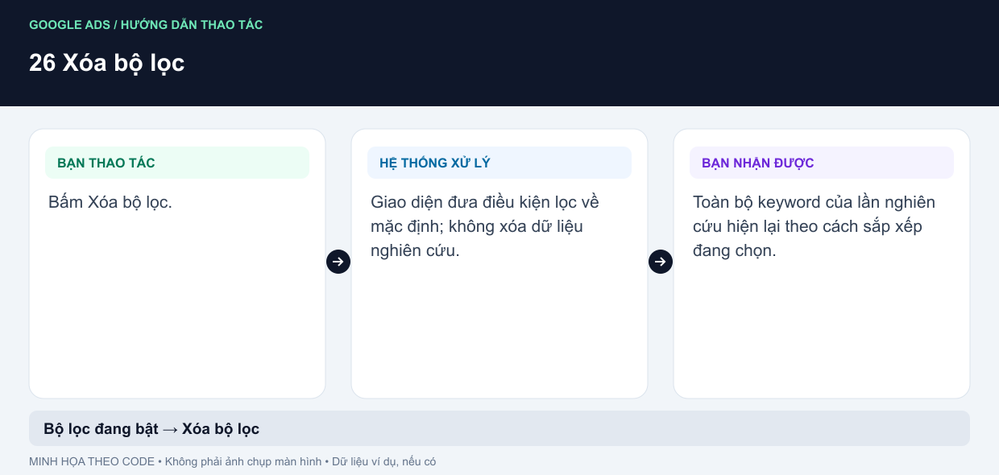

**Minh họa: Bỏ lựa chọn keyword**

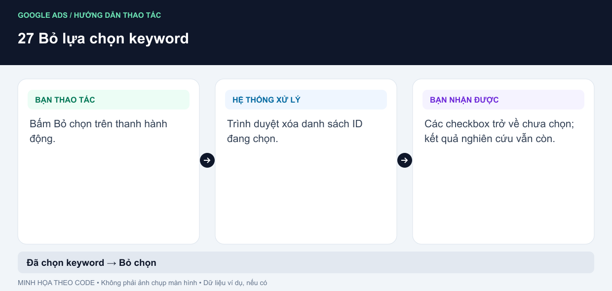
<!-- illustration:end -->

## 6. Mở lại lịch sử

**Người dùng:** bấm một nghiên cứu có trạng thái “Sẵn sàng”.

**Backend:** kiểm tra nghiên cứu thuộc người dùng, đọc dữ liệu đã lưu và tính lại các thông tin phân loại/điểm bằng quy tắc hiện tại. Không gọi Google lấy số liệu mới.

**Giao diện:** thay bảng kết quả, bỏ lựa chọn keyword trước đó. Màn tải tối đa 100 nghiên cứu nhưng chỉ hiển thị 12 mục đầu. Mục đang chạy hoặc lỗi không bấm mở được. Sau một lần quét lỗi, danh sách không tự tải lại ngay trong nhánh xử lý lỗi.

<!-- illustration:start -->
**Minh họa: Mở lại nghiên cứu trong lịch sử**

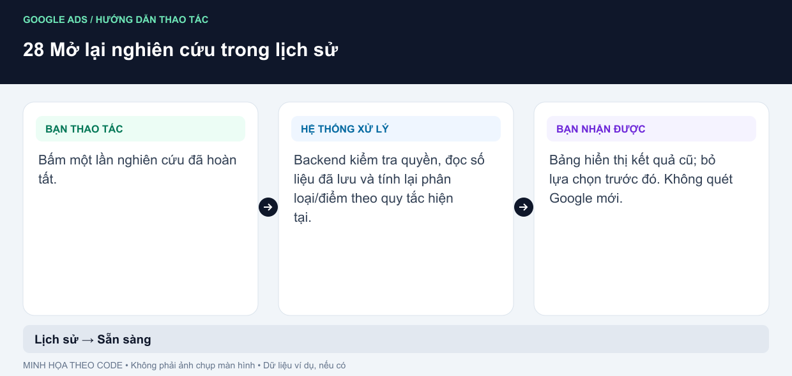
<!-- illustration:end -->

## 7. Lưu dự án tiềm năng

**Người dùng:** chọn ít nhất một keyword → “Lưu dự án” → nhập tên, trạng thái, tag, mô tả, ghi chú và website nếu có → lưu.

Tên là bắt buộc; website có thể bổ sung sau. Trạng thái ban đầu gồm Mới, Đang nghiên cứu, Tiềm năng hoặc Loại bỏ.

**Backend:** kiểm tra nghiên cứu nguồn thuộc người dùng, tạo dự án tiềm năng và lưu bản sao các keyword đã chọn, gồm số liệu, phân loại, điểm, giải thích điểm và tham chiếu về nguồn nghiên cứu. Lưu kèm thị trường, ngôn ngữ và tài khoản Ads nguồn.

**Kết quả:** giao diện bỏ lựa chọn keyword, tăng số đếm và chuyển sang “Dự án tiềm năng”. Bản ghi này chưa tạo một dự án chính thức trong Projects.

Backend hiện chỉ nhận **1–500 keyword cho mỗi dự án tiềm năng**, dù màn khám phá có thể trả 2.000 keyword. Giao diện chưa chặn chọn hơn 500 trước khi gửi; chọn quá giới hạn sẽ lưu thất bại.

<!-- illustration:start -->
**Minh họa: Mở form lưu dự án tiềm năng**

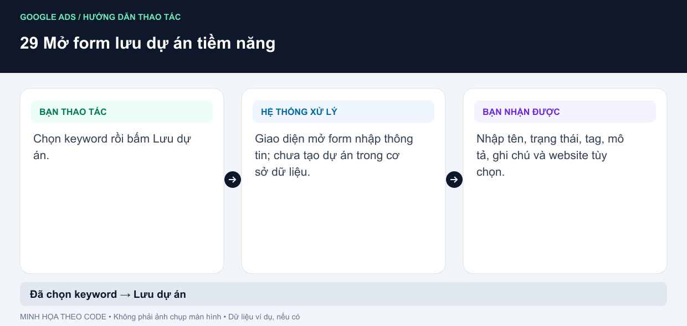

**Minh họa: Xác nhận lưu dự án tiềm năng**

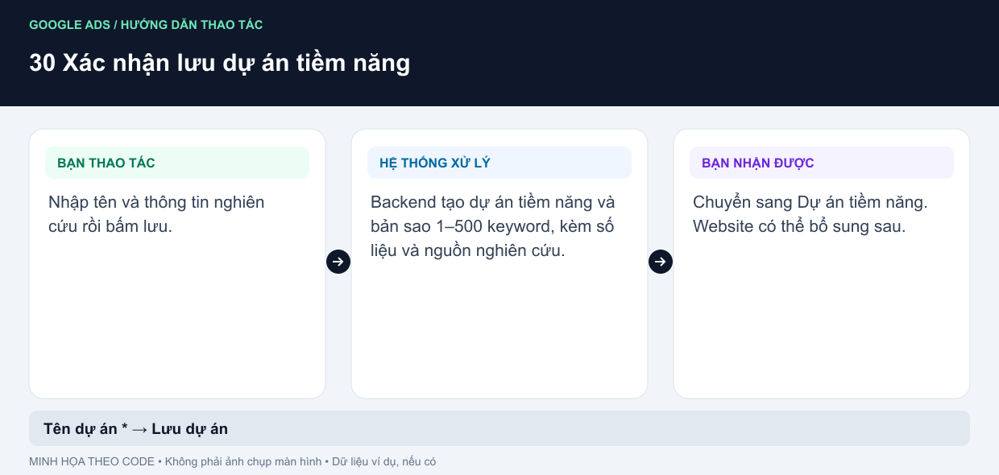
<!-- illustration:end -->

## 8. Quản lý dự án tiềm năng

### 8.1. Xem và tìm dự án

Màn tải tối đa 100 dự án tiềm năng. Người dùng tìm theo tên, mô tả, tag hoặc lọc trạng thái trên danh sách đã tải. Mỗi thẻ hiện số keyword, tổng lượng tìm kiếm và điểm cao nhất trong các keyword của dự án đó.

Bấm “Mở nghiên cứu” để mở bảng chi tiết bên phải từ dữ liệu đã tải.

<!-- illustration:start -->
**Minh họa: Tìm dự án tiềm năng**

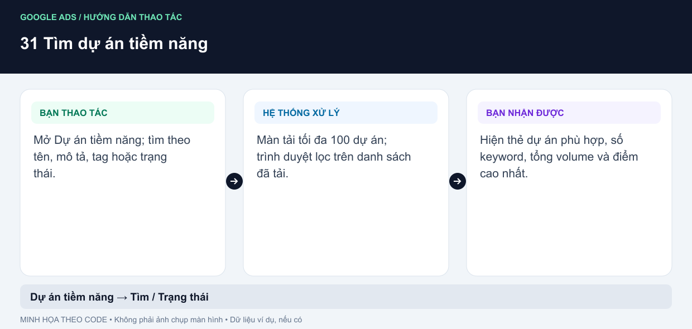

**Minh họa: Mở nghiên cứu tiềm năng**

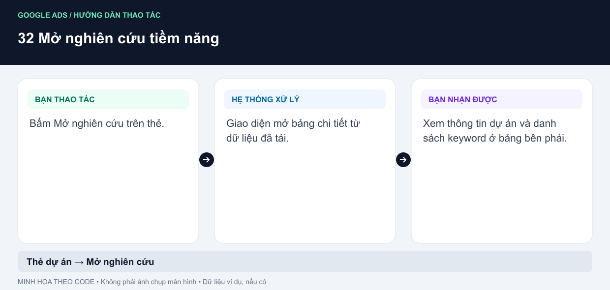
<!-- illustration:end -->

### 8.2. Sửa và lưu

Người dùng sửa tên, trạng thái, website, mô tả, tag, ghi chú; có thể sửa mục đích tìm kiếm thủ công hoặc bỏ keyword khỏi dự án tiềm năng.

Chỉ khi bấm **“Lưu thay đổi”**, backend mới lưu thông tin mới và thay thế danh sách keyword của bản nghiên cứu tiềm năng. Phải còn ít nhất một keyword. Mục đích sửa thủ công được ưu tiên hơn mục đích suy ra ban đầu; sửa mục đích không tự tính lại điểm cơ hội.

<!-- illustration:start -->
**Minh họa: Sửa thông tin dự án**

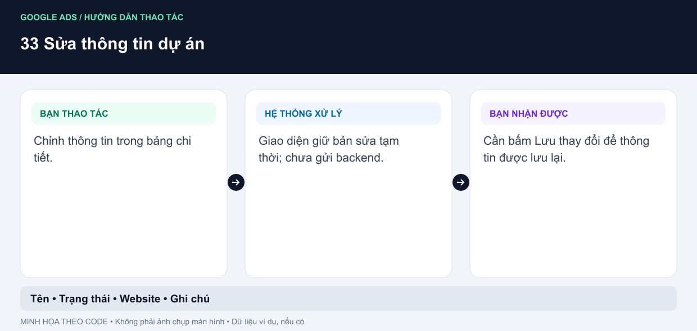

**Minh họa: Sửa mục đích tìm kiếm**

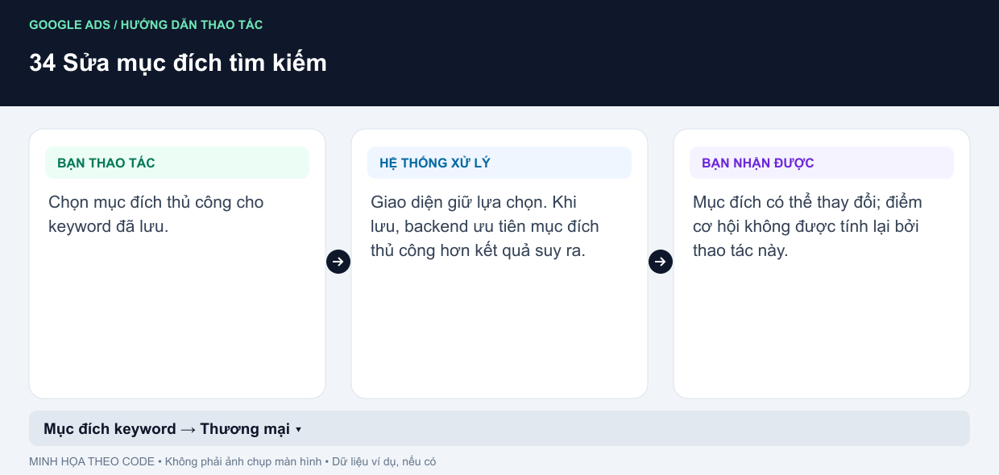

**Minh họa: Bỏ keyword khỏi dự án tiềm năng**

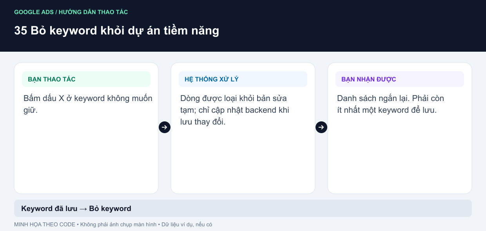

**Minh họa: Lưu thay đổi**

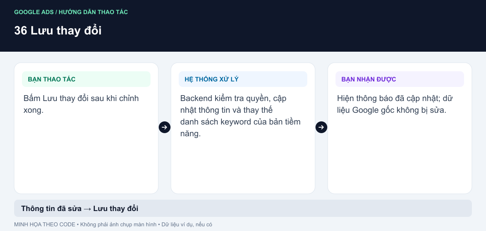
<!-- illustration:end -->

### 8.3. Chuyển thành dự án

**Người dùng:** nhập website/affiliate URL và bấm “Chuyển thành dự án”.

**Backend:**

1. Kiểm tra quyền sở hữu dự án tiềm năng.
2. Nếu đã có liên kết sang dự án chính thức, trả bản ghi đang có.
3. Kiểm tra có URL, chuẩn hóa URL và lấy tên miền.
4. Tìm hoặc tạo bản ghi dự án affiliate theo logic lưu dự án của ứng dụng; dùng tên đã lưu của dự án tiềm năng và keyword đầu tiên làm từ khóa tìm kiếm ban đầu nếu có.
5. Gắn hai bản ghi với nhau, đổi trạng thái dự án tiềm năng thành “Đã thành dự án”.

**Kết quả:** xuất hiện nút “Mở Projects”, dẫn tới danh sách Projects. Bước này tạo/gắn bản ghi dự án; không khởi động quét website, không tạo chiến dịch Google Ads và không tự chuyển toàn bộ keyword thành một lần quét keyword của dự án chính thức.

Nút chuyển chỉ gửi URL hiện tại. Nếu vừa sửa tên, mô tả, ghi chú hoặc danh sách keyword mà chưa bấm “Lưu thay đổi”, những sửa đổi đó không được gửi kèm thao tác chuyển. Cần lưu trước khi chuyển nếu muốn dùng thông tin mới.

<!-- illustration:start -->
**Minh họa: Chuyển thành dự án chính thức**

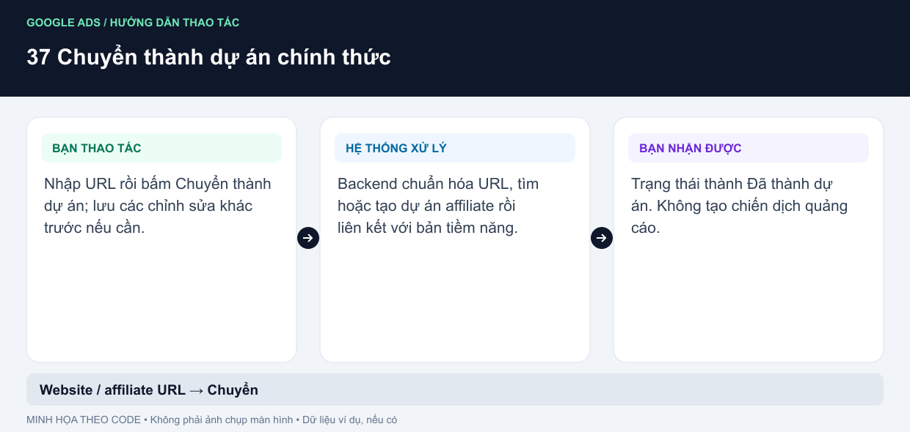

**Minh họa: Mở danh sách Projects**

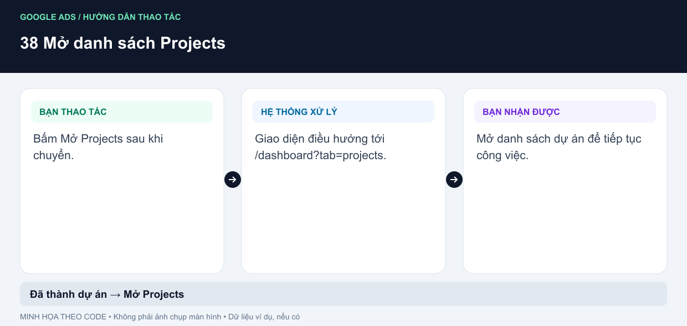
<!-- illustration:end -->

### 8.4. Xóa dự án tiềm năng

Bấm xóa → xác nhận “Xóa snapshot”. Backend xóa dự án tiềm năng và các keyword sao chép thuộc bản ghi này. Dữ liệu nghiên cứu Google gốc và dự án chính thức đã liên kết không bị xóa theo.

<!-- illustration:start -->
**Minh họa: Xóa dự án tiềm năng**

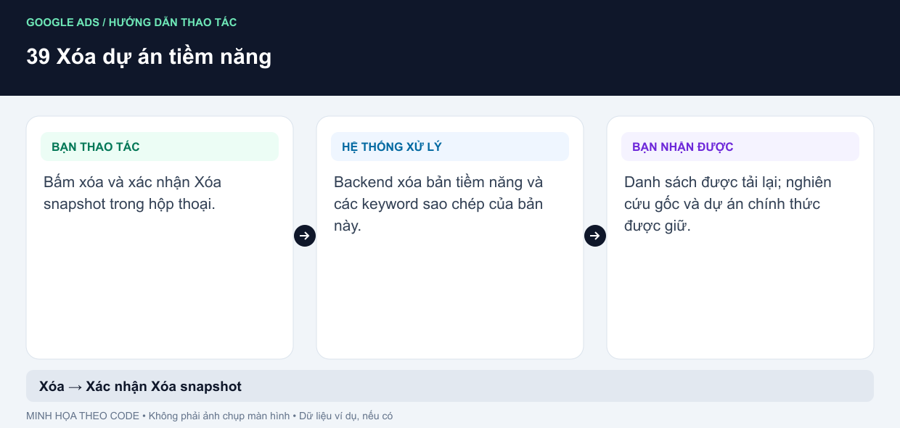
<!-- illustration:end -->

## 9. Những điểm chưa đồng nhất trong code hiện tại

Các mục sau là kết quả đọc code, chưa phải kết quả kiểm thử bằng tài khoản Google thật:

1. **“Gửi auth lại” chưa hoạt động đúng ý nghĩa nút:** giao diện có nút cho mail đã ủy quyền, nhưng backend trả lỗi “đã được ủy quyền rồi”.
2. **Ký hiệu tiền tệ bị cố định:** bảng keyword luôn thêm `$`; backend chỉ đổi đơn vị micros thành số tiền và không có bước quy đổi ngoại tệ. Không nên mặc định mọi số hiển thị đều đã được đổi sang USD.
3. **Thông báo ủy quyền thành công không đảm bảo lấy được tài khoản:** lỗi quét tài khoản có thể bị chuyển thành danh sách rỗng sau khi đã lưu ủy quyền.
4. **Thanh trạng thái “Dữ liệu Google Ads đã ủy quyền” là nhãn tĩnh:** nó vẫn được render trước khi xác định người dùng có tài khoản khả dụng hay không.
5. **Trạng thái “Đã thành dự án” có thể chọn thủ công trong form sửa:** việc đổi trạng thái qua “Lưu thay đổi” không thực hiện tạo/liên kết dự án như nút “Chuyển thành dự án”. Có thể phát sinh trạng thái hiển thị đã chuyển nhưng chưa có liên kết thật.
6. **Lịch sử và danh sách tiềm năng có giới hạn tải/hiển thị:** giao diện chưa có phân trang cho phần dữ liệu vượt các giới hạn đã nêu.

## 10. Bảng đối chiếu thao tác với API

Các đường dẫn dưới đây dùng tiền tố `/api` của backend.

| Thao tác | API phía ứng dụng |
|---|---|
| Lấy tài khoản cho form | `GET /api/keyword-planner/accounts` |
| Quét bằng keyword | `POST /api/keyword-planner/scan/keywords` |
| Quét bằng website | `POST /api/keyword-planner/scan/url` |
| Xem lịch sử | `GET /api/keyword-planner/jobs` |
| Mở kết quả đã lưu | `GET /api/keyword-planner/jobs/{id}/results` |
| Tạo/xem danh sách dự án tiềm năng | `POST / GET /api/keyword-planner/candidates` |
| Lưu sửa/xóa dự án tiềm năng | `PATCH / DELETE /api/keyword-planner/candidates/{id}` |
| Chuyển thành dự án | `POST /api/keyword-planner/candidates/{id}/promote` |
| Thêm/xem mail | `POST / GET /api/mail-delegation/mails` |
| Gửi link xác nhận | `POST /api/mail-delegation/mails/{id}/send-auth` |
| Xử lý xác nhận từ Google | `POST /api/mail-delegation/callback` |
| Xóa mail | `DELETE /api/mail-delegation/mails/{id}` |

## 11. Mã nguồn đã đối chiếu

Đường dẫn tương đối từ tài liệu này:

- [Tên tab và điều hướng](../client/components/features/dashboard/DashboardSidebar.tsx)
- [Hai phần của Google Ads](../client/components/features/dashboard/GoogleAdsTab.tsx)
- [Keyword Planner và lịch sử](../client/components/features/dashboard/KeywordPlannerTab.tsx)
- [Form nghiên cứu](../client/components/features/dashboard/keyword-planner/KeywordResearchForm.tsx)
- [Bảng kết quả và chọn keyword](../client/components/features/dashboard/keyword-planner/KeywordResultsWorkspace.tsx)
- [Lọc, sắp xếp và tổng hợp](../client/components/features/dashboard/keyword-planner/keywordPlanner.utils.ts)
- [Dự án tiềm năng](../client/components/features/dashboard/keyword-planner/CandidateProjectsView.tsx)
- [Ủy quyền Mail](../client/components/features/dashboard/MailDelegationTab.tsx)
- [Trang nhận xác nhận Google](../client/app/api/auth/google/callback/page.tsx)
- [Các API và thông báo kết quả](../server/app/api/keyword_planner/router.py)
- [Logic xử lý backend](../server/app/api/keyword_planner/service.py)
- [Đọc/ghi cơ sở dữ liệu](../server/app/api/keyword_planner/repository.py)
- [Cấu trúc dữ liệu và quan hệ xóa](../server/app/api/keyword_planner/model.py)
- [Giới hạn dữ liệu đầu vào](../server/app/api/keyword_planner/schema.py)
- [Quy tắc phân loại và chấm điểm](../server/app/api/keyword_planner/classification.py)
- [Gọi Google Ads và chuẩn hóa số liệu](../server/app/shared/services/google_ads.py)

Tài liệu ghi nhận hành vi từ mã nguồn hiện tại; chưa thực hiện gửi email, xác nhận OAuth hoặc gọi Google Ads thật trong lần đọc này.
