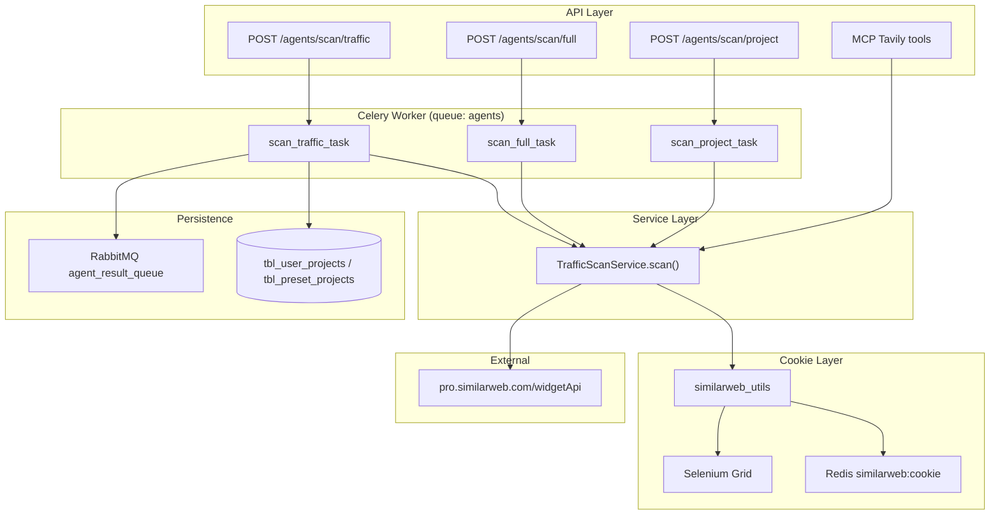

# SimilarWeb — Luồng mới (MultiAgent)

> Tài liệu này mô tả **luồng SimilarWeb mới** trong module `MultiAgent/services/scan/`.
> Dùng cho AI agent / developer cần hiểu, vận hành, hoặc mở rộng tính năng traffic scan.

---

## 1. Tổng quan

### 1.1 Mục tiêu

Lấy dữ liệu traffic website (monthly visits, breakdown theo country/source/social) từ **SimilarWeb Pro**, lưu vào project (`tbl_user_projects` / `tbl_preset_projects`).

### 1.2 Cách tiếp cận

| Phương án | Luồng mới dùng? |
|-----------|-----------------|
| SimilarWeb Official REST API (API key trả phí) | ❌ Không |
| SimilarWeb Pro **widgetApi** (undocumented, gọi từ browser session) | ✅ Có |

**Flow tóm tắt:**

```
Selenium Grid login SimilarWeb Pro
    → extract session cookie
    → cache Redis
    → httpx GET widgetApi (4 endpoints)
    → parse + merge
    → lưu DB + publish RabbitMQ
```

### 1.3 Khác biệt với luồng cũ

| | Luồng cũ | Luồng mới (MultiAgent) |
|---|----------|------------------------|
| Cookie utils | `api/src/project/project_component/utils.py` | `api/src/MultiAgent/services/scan/similarweb_utils.py` |
| Scan service | `ScanTrafficService` trong `project_component/service.py` | `TrafficScanService` trong `traffic_service.py` |
| Celery task | `project_component/tasks.py` | `MultiAgent/services/scan/tasks.py` → `scan_traffic_task` |
| API route | `project_component/routes.py` | `POST /agents/scan/traffic` |
| Redis cookie key | `{REDIS_PREFIX}:similarweb:cookie` (namespace) | `similarweb:cookie` (raw key, không namespace) |
| Lưu DB | Bảng traffic riêng (`ProjectTrafficGlobal`, …) | JSONB `traffic_details` trên project |

> **Lưu ý quan trọng:** `main.py` startup load `SIMILARWEB_COOKIE` từ `.env` vào **Redis namespace cũ** (`similarweb:cookie` qua `RedisClient`). Luồng mới đọc key **`similarweb:cookie` trực tiếp** (không qua `RedisNamespace`). Nếu seed cookie thủ công, phải set đúng key mà `similarweb_utils.py` dùng.

---

## 2. Sơ đồ kiến trúc



---

## 3. Bản đồ file

| File | Trách nhiệm |
|------|-------------|
| `api/src/MultiAgent/services/scan/similarweb_utils.py` | Login Selenium, extract cookie, Redis cache, distributed lock, build HTTP headers |
| `api/src/MultiAgent/services/scan/traffic_service.py` | Gọi 4 widgetApi, parse response, merge 4 tháng, trả dict chuẩn |
| `api/src/MultiAgent/services/scan/tasks.py` | Celery task `scan_traffic_task`, resolve URL, lưu DB, publish RabbitMQ |
| `api/src/MultiAgent/routers/scan_routes.py` | REST API trigger scan |
| `api/src/MultiAgent/services/mcp/tavily_scan_tools.py` | MCP tool gọi `TrafficScanService.scan()` |
| `api/core/config.py` | Env vars: `SIMILARWEB_EMAIL`, `SIMILARWEB_PASSWORD`, `SELENIUM_HUB_URL`, … |
| `api/src/projects/models.py` | Cột `monthly_visits`, `period_month`, `traffic_info`, `traffic_details` |

---

## 4. Thiết lập môi trường

### 4.1 Biến môi trường bắt buộc

```env
# SimilarWeb Pro account
SIMILARWEB_EMAIL=your-account@company.com
SIMILARWEB_PASSWORD=your-password

# Selenium Grid (remote WebDriver)
SELENIUM_HUB_URL=http://selenium-hub:4444/wd/hub

# Redis (cookie cache)
REDIS_URL=redis://localhost:6379/0
```

### 4.2 Biến môi trường tùy chọn

```env
# Cookie seed thủ công (bypass Selenium lần đầu) — set trực tiếp vào Redis key similarweb:cookie
SIMILARWEB_COOKIE=.SGTOKEN.SIMILARWEB.COM=...;_sw_pin=...;...

# noVNC — khi SimilarWeb yêu cầu xác minh thiết bị / reset password thủ công
NOVNC_URL=http://localhost:7900

# RabbitMQ — publish kết quả scan cho agent
AGENT_RESULT_QUEUE=agent_result_queue
```

### 4.3 Hạ tầng cần chạy

| Service | Mục đích |
|---------|----------|
| **Redis** | Cache cookie session (không TTL, refresh khi 401) |
| **Selenium Grid + Chrome** | Login SimilarWeb Pro, extract cookie |
| **noVNC** (khuyến nghị) | Can thiệp thủ công khi bị block "New Device Detected" / "Set up your new password" |
| **Celery worker** queue `agents` | Chạy `scan_traffic_task` background |
| **RabbitMQ** | Nhận kết quả scan qua `agent_result_queue` |

### 4.4 Chạy Celery worker

```bash
python -m celery -A api.core.celery_config worker \
  --loglevel=info \
  --queues=agents \
  --concurrency=2
```

Worker cần truy cập được `SELENIUM_HUB_URL` và `REDIS_URL`.

---

## 5. Cookie lifecycle (`similarweb_utils.py`)

### 5.1 Cookie fields cần extract

Sau khi login thành công, Selenium extract các cookie sau (join bằng `;`):

```
.SGTOKEN.SIMILARWEB.COM
_sw_pin
locale
_dd_s
_sw_pin_ps
aws-waf-token
RESET_PRO_CACHE
sgID
```

### 5.2 Redis keys

| Key | Mục đích |
|-----|----------|
| `similarweb:cookie` | Cookie string dùng cho widgetApi |
| `similarweb:cookie:lock` | Distributed lock khi refresh (tránh nhiều worker chạy Selenium cùng lúc) |

Lock timeout: **300s** (Selenium session). Lock wait: **320s** (worker khác chờ).

### 5.3 Flow lấy headers

```python
headers = await get_headers()
# 1. get_cookie_from_cache() → Redis
# 2. Nếu cache rỗng → refresh_cookie() → Selenium login → save Redis
# 3. Build dict headers (User-Agent, referer, x-sw-page, cookie, ...)
```

### 5.4 Flow refresh cookie (khi 401/403)

```python
await refresh_cookie(stale_cookie=headers.get("cookie"))
headers = await get_headers()
# Retry request 1 lần
```

**Race condition handling:**

- Worker phát hiện cookie stale → acquire lock
- Nếu worker khác đã refresh (cookie trong Redis ≠ stale_cookie) → dùng cookie mới, **không** chạy Selenium lại
- Nếu cache vẫn là cookie cũ → xóa → chạy Selenium → save

### 5.5 Selenium login flow

1. `_create_driver()` → kết nối `SELENIUM_HUB_URL`, Chrome non-headless (`headless=False`)
2. `_ensure_session()` → mở `https://pro.similarweb.com/`
3. Nếu title = `"Log In to Similarweb Platform"` → `_login()` với `#input-email`, `#input-password`, `[data-automation-name="submit-button"]`
4. Edge cases → `_wait_for_manual()` qua noVNC (timeout 10 phút):
   - `"New Device Detected"`
   - `"Set up your new password"`
   - Vẫn stuck ở login page
5. `_get_cookies_string()` → extract `COOKIE_FIELDS` → return

### 5.6 HTTP headers gửi widgetApi

Headers mô phỏng browser SimilarWeb Pro (quan trọng: `referer`, `x-sw-page`, `x-requested-with`, `cookie`).

---

## 6. Traffic scan service (`traffic_service.py`)

### 6.1 Entry point

```python
from api.src.MultiAgent.services.scan.traffic_service import TrafficScanService

result = await TrafficScanService.scan(url="https://www.example.com")
# result: dict | None
```

**Input:** URL bất kỳ → extract domain (bỏ `www.`, protocol, path, port).

**Output khi thành công:**

```python
{
    "monthly_visits": 45000000,       # int — visits tháng mới nhất
    "period_month": "2025-10",        # str — "YYYY-MM"
    "traffic_info": 45000000,         # int — alias monthly_visits
    "traffic_details": {
        "global": [...],                # list — 4 tháng
        "country": [...],               # list — optional
        "source": {...},                # dict — optional
        "social": [...],                # list — optional
    },
}
```

**Output khi thất bại:** `None` (domain không có data SW, lỗi Selenium, lỗi network, …).

### 6.2 4 widgetApi endpoints

Base URL: `https://pro.similarweb.com/widgetApi`

| # | Endpoint | → `traffic_details` key |
|---|----------|-------------------------|
| 1 | `WebsiteOverview/EngagementOverview/Table` | `global[]` |
| 2 | `WebsiteGeographyExtended/GeographyExtended/Table` | `country[]` |
| 3 | `MarketingMixTotal/TrafficSourcesOverview/PieChart` | `source{}` |
| 4 | `WebsiteOverviewDesktop/TrafficSourcesSocial/PieChart` | `social[]` |

### 6.3 Tham số chung

- `keys`: domain (ví dụ `example.com`)
- `from` / `to`: format `YYYY|MM|DD` (helper `_sw_date()`)
- `country`: `999` (worldwide)
- `timeGranularity`: `Monthly`
- `includeSubDomains`: `true`

### 6.4 Logic scan theo tháng

- Scan **4 tháng** gần nhất (`_get_scan_months(n_months=4)`)
- SimilarWeb delay data ~1 tháng → bắt đầu từ **tháng trước** (không phải tháng hiện tại)
- Mỗi tháng:
  1. Gọi `_fetch_global` trước
  2. Nếu global = `[]` (HTTP 400 hoặc TotalCount=0) → domain không có data SW → skip 3 endpoint còn lại
  3. Nếu có global → `asyncio.gather` country + source + social song song
- **Pass 2 retry:** nếu >1 tháng fail (lỗi thật, không phải no-data) → refresh cookie → retry các tháng fail

### 6.3 Schema chi tiết `traffic_details`

#### `global[]` (mỗi phần tử = 1 tháng)

```python
{
    "period_month": "2025-10",
    "total_visits_monthly": 45000000,
    "avg_visits_monthly": 1500000,
    "unique_visits_monthly": 30000000,
    "repeat_visits_monthly": 5000000,
    "pages_per_visit": 3.2,
    "avg_visit_duration": 180,
    "bounce_rate_percentage": 45.5,
}
```

`total_visits_monthly` = `round(VisitsPerUser * UniqueUsers)` từ raw SW response.

#### `country[]`

```python
{
    "country_code": "VN",
    "country_name": "Vietnam",
    "traffic_share_percentage": 65.0,
    "total_visits_monthly": 29250000,  # = global_total * share
    "pages_per_visit": 2.8,
    "avg_visit_duration": 150,
    "bounce_rate_percentage": 40.0,
}
```

#### `source{}`

```python
{
    "period_month": "2025-10",
    "organic_search": 42,
    "social": 18,
    "email": 3,
    "display_ads": 2,
    "direct": 22,
    "referrals": 5,
    "paid_search": 8,
}
```

> Giá trị là **số nguyên** (visits hoặc % tùy raw SW — code dùng `round()` từ raw `Total` object).

#### `social[]`

```python
{
    "platform_name": "youtube",
    "share_percentage": 0.45,
}
```

### 6.4 Xử lý lỗi HTTP

| Status | Hành vi |
|--------|---------|
| 401 / 403 | Refresh cookie → retry 1 lần |
| 400 | Domain không có data → return `[]` (global) hoặc `None` |
| 200 + empty Data | Domain chưa được index → return `[]` |
| 5xx / timeout | Log warning, đánh dấu tháng fail → có thể trigger pass 2 retry |

---

## 7. Celery task flow (`tasks.py`)

### 7.1 Task definition

```python
@celery_app.task(
    name="tasks.scan.traffic",
    bind=True,
    max_retries=1,
    soft_time_limit=180,   # 3 phút
    time_limit=210,
)
def scan_traffic_task(self, project_id, url, user_id, project_table="user"):
    ...
```

### 7.2 Async logic `_run_traffic_scan`

```
Session 1 (DB):
  _resolve_scan_target() → (scan_url, project_uuid)
  - Mode project_id: lấy URL từ tbl_user_projects / tbl_preset_projects
  - Mode url: dùng URL trực tiếp, project_uuid = None

Scan (KHÔNG giữ DB connection):
  traffic_data = await TrafficScanService.scan(scan_url)

Session 2 (DB):
  _save_to_db() → update project
  - project_table='user': update UserProject hoặc smart match by URL
  - project_table='preset': update/upsert PresetProject

Publish RabbitMQ:
  type: "scan_traffic_result"
  data: { status, url, project_id, monthly_visits, period_month, traffic_details }
```

### 7.3 Quy tắc lưu DB

| Mode | Hành vi |
|------|---------|
| `project_id` có | Update project theo UUID |
| `url` + project đã tồn tại (smart match) | Update project đó |
| `url` + chưa có project | **Không tạo mới**, chỉ publish RabbitMQ |

Payload lưu (chỉ field có giá trị):

```python
{
    "monthly_visits": int,
    "period_month": str,
    "traffic_info": int,
    "traffic_details": dict,
}
```

---

## 8. API endpoints

Base path: `/agents/scan` (prefix từ `MultiAgent/routers/routes.py`).

### 8.1 `POST /agents/scan/traffic`

**Auth:** `get_current_user` (Kong headers → `HeaderInfo`).

**Body (`ScanRequest`):**

```json
{
  "project_id": "3fa85f64-5717-4562-b3fc-2c963f66afa6",
  "project_table": "user"
}
```

hoặc

```json
{
  "url": "https://www.example.com",
  "project_table": "user"
}
```

**Response (ngay lập tức):**

```json
{
  "success": true,
  "task_id": "celery-task-uuid",
  "project_id": "...",
  "url": "...",
  "message": "Traffic scan đã được khởi tạo...",
  "status": "queued"
}
```

Kết quả thực tế đến sau qua DB update + RabbitMQ `scan_traffic_result`.

### 8.2 Các endpoint liên quan

| Endpoint | SimilarWeb |
|----------|------------|
| `POST /agents/scan/full` | Policy + traffic song song |
| `POST /agents/scan/project` | Batch URLs → policy + traffic → PresetProject |
| MCP `tavily_scan_tools` | `_tavily_traffic_scan()` → `TrafficScanService.scan()` |

Traffic scan **luôn** dùng SimilarWeb (không phụ thuộc `scan_mode` của policy).

---

## 9. Tích hợp cho agent / MCP

### 9.1 Gọi trực tiếp service (trong code Python)

```python
from api.src.MultiAgent.services.scan.traffic_service import TrafficScanService

data = await TrafficScanService.scan("https://affiliate.example.com")
if data:
    monthly = data["monthly_visits"]
    details = data["traffic_details"]
```

### 9.2 Trigger qua REST API

```http
POST /agents/scan/traffic
Authorization: Bearer <token>
Content-Type: application/json

{"url": "https://example.com"}
```

Poll kết quả qua:
- DB: field `monthly_visits`, `traffic_details` trên project
- RabbitMQ: message type `scan_traffic_result` trên `AGENT_RESULT_QUEUE`

### 9.3 Message RabbitMQ format

```json
{
  "type": "scan_traffic_result",
  "task_id": "celery-uuid",
  "status": "success",
  "url": "https://example.com",
  "project_id": "uuid-or-empty",
  "monthly_visits": 45000000,
  "period_month": "2025-10",
  "traffic_details": { "global": [...], "country": [...], "source": {...}, "social": [...] }
}
```

Failed:

```json
{
  "type": "scan_traffic_result",
  "task_id": "...",
  "status": "failed",
  "url": "https://example.com",
  "error": "SimilarWeb không trả về traffic data cho ..."
}
```

---

## 10. Quy ước kiến trúc (bắt buộc khi mở rộng)

Theo `AGENTS.md`:

```
route → service → repository
```

| Layer | SimilarWeb traffic |
|-------|---------------------|
| **Route** | `scan_routes.py` — validate request, dispatch Celery, không business logic |
| **Service** | `TrafficScanService` — orchestrate widgetApi calls, parse data |
| **Utils (infra)** | `similarweb_utils.py` — Selenium, Redis cookie (không phải repository) |
| **Repository** | `UserProjectRepository` / `PresetProjectRepository` — lưu DB trong Celery task |

**Không** viết SQL/widgetApi call trực tiếp trong route.
**Không** viết Selenium logic trong `traffic_service.py` — chỉ gọi `get_headers()` / `refresh_cookie()`.

---

## 11. Checklist triển khai mới (cho agent implement)

### Phase 1 — Infrastructure

- [ ] Redis chạy, `REDIS_URL` đúng
- [ ] Selenium Grid chạy, `SELENIUM_HUB_URL` reachable từ Celery worker
- [ ] noVNC expose (nếu cần manual verify)
- [ ] `SIMILARWEB_EMAIL` / `SIMILARWEB_PASSWORD` trong `.env`

### Phase 2 — Verify cookie

- [ ] Chạy thử: `await refresh_cookie()` hoặc trigger 1 traffic scan
- [ ] Kiểm tra Redis: `GET similarweb:cookie` có giá trị
- [ ] Log `[SW_UTILS] Cookies extracted successfully`

### Phase 3 — Verify scan

- [ ] `await TrafficScanService.scan("google.com")` → có `monthly_visits`
- [ ] Domain nhỏ/không có data → return `None` (expected)

### Phase 4 — End-to-end

- [ ] Celery worker queue `agents` running
- [ ] `POST /agents/scan/traffic` → nhận `task_id`
- [ ] DB project được update `monthly_visits`, `traffic_details`
- [ ] RabbitMQ nhận `scan_traffic_result`

---

## 12. Troubleshooting

| Triệu chứng | Nguyên nhân có thể | Cách xử lý |
|-------------|-------------------|------------|
| `SELENIUM_HUB_URL chưa được cấu hình` | Thiếu env | Set `SELENIUM_HUB_URL` |
| `SIMILARWEB_EMAIL / SIMILARWEB_PASSWORD chưa cấu hình` | Thiếu credentials | Set env |
| Stuck ở login / device verify | SimilarWeb security | Mở noVNC (`NOVNC_URL`), xử lý thủ công |
| HTTP 401 liên tục | Cookie invalid, account locked | Xóa Redis key `similarweb:cookie`, refresh lại |
| `Không có dữ liệu global traffic` | Domain không có trên SW | Expected — không phải bug |
| Nhiều worker refresh cookie cùng lúc | Race condition | Đã có distributed lock — kiểm tra Redis lock hoạt động |
| Scan chậm (~30s+) | 4 tháng × 4 endpoints = 16 requests | Expected; có thể giảm `n_months` nếu cần |
| Cookie từ `.env` không được dùng | Key mismatch luồng cũ/mới | Set trực tiếp `similarweb:cookie` trên Redis |

### Debug commands

```bash
# Kiểm tra cookie trong Redis
redis-cli GET similarweb:cookie

# Xóa cookie force refresh
redis-cli DEL similarweb:cookie

# Kiểm tra Selenium Hub
curl http://selenium-hub:4444/status
```

---

## 13. Mở rộng / customize

### Thêm endpoint widgetApi mới

1. Thêm hàm `_fetch_xxx()` trong `traffic_service.py`
2. Gọi qua `_get_widget()` (tự handle 401 refresh)
3. Merge vào `traffic_details` dict trong `TrafficScanService.scan()`
4. Cập nhật schema docs trong `api/src/projects/schemas.py` nếu cần

### Giảm số tháng scan

Sửa `_get_scan_months(n_months=4)` → giá trị nhỏ hơn (trade-off: ít historical data).

### Thêm cache response theo domain

Hiện **chưa có** — mỗi scan gọi live SW API. Nếu cần, thêm Redis cache layer trong service (không phải cookie cache).

---

## 14. Tham chiếu code nhanh

```
similarweb_utils.py
  get_headers()           → dict headers cho widgetApi
  refresh_cookie()        → Selenium login + Redis save
  get_cookies_via_selenium() → blocking Selenium (gọi qua asyncio.to_thread)

traffic_service.py
  TrafficScanService.scan(url) → dict | None
  _fetch_global/country/sources/social → parse từng endpoint

tasks.py
  scan_traffic_task       → Celery entry
  _run_traffic_scan       → async orchestration
  _publish_scan_result    → RabbitMQ agent_result_queue

scan_routes.py
  POST /traffic           → dispatch scan_traffic_task.delay()
```

---

## 15. Liên hệ luồng cũ

Nếu cần tham khảo implementation gốc (port source):

- `api/src/project/project_component/utils.py` — Selenium login (bản gốc)
- `api/src/project/project_component/service.py` — `ScanTrafficService` (lưu bảng traffic riêng)

**Không mix** hai luồng cookie Redis. Luồng mới là source of truth cho MultiAgent scan.
